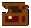

<div align="center">



# RotMG Account Manager

**English** · [Português](README.pt-BR.md)

An account tracker for **Realm of the Mad God**: characters, stat pots (8/8), exaltations, vault, pets, graveyard and a UT/ST item collection.


</div>

A static site with no build step and no dependencies. Data is saved in the browser's `localStorage`.

## Features

- **Multiple accounts** with an account-level dashboard and progression
- **Characters**: class, stat pots, exaltations and equipment
- **Vault and inventory** with capacity rules
- **Pets**: pet yard and fusion
- **Graveyard**: fallen characters with a gravestone based on how many stats were maxed
- **Item index**: collection of UT/ST items grouped by tier, with sprites for 750+ items

## Running locally

Because it uses ES modules, the app must be served over HTTP (opening `index.html` directly via `file://` won't work):

```bash
python3 -m http.server 8000
# open http://localhost:8000
```

Any static server works (`npx serve`, VS Code's Live Server extension, etc.).

## Deploying to GitHub Pages

1. In **Settings → Pages**, choose *Deploy from a branch*, branch `main`, folder `/ (root)`.
2. The site will be available at `https://<your-user>.github.io/<repo-name>/`.

## Project structure

```
index.html              root page (loads CSS and js/main.js)
css/
  base.css              color tokens, layout, header, buttons
  components.css        item cards, modals, vault, inventory
  home.css              accounts screen, dashboard, account progression
  characters.css        characters, pots, exaltations, graveyard
  pets.css              pets, pet yard, fusion
js/
  main.js               entry point
  state.js              state, localStorage load/save, migrations
  utils.js              generic helpers (escaping, ids, dates)
  data/
    items.js            item and class catalog
    game.js             game constants (pots, exalts, account levels, pets)
    sprites.js          name → sprite file map
  logic/                DOM-free rules (stats, vault, exalts, pets, capacity)
  ui/
    core.js             screen router, header, generic modals
    icons.js            pixel-art icons and sprite helpers
  views/                one screen per file (saves, home, characters, vault…)
assets/sprites/         PNGs for classes, items, gravestones and UI
```

Game rules live in `js/logic/` with no DOM access, and each screen is a self-contained module in `js/views/`, so adding a screen or fixing a rule touches a single file.

### Where to make changes

- **New item or wrong drop**: `js/data/items.js`. For the sprite, add the PNG to `assets/sprites/items/<category>/` and an entry in `js/data/sprites.js` (items without a sprite show a generic icon).
- **New screen**: create `js/views/myScreen.js`, export a `renderX` function and add the case to `render()` in `js/ui/core.js`.
- **Game rule** (vault capacity, pet fusion, etc.): `js/logic/`.

## Saved data

Everything is stored in `localStorage` under the `rotmg-account-v3` key. Data belongs to the browser and the site's address, so switching domains (e.g. from `localhost` to GitHub Pages) starts with empty accounts.

## License

The code is released under the [MIT](LICENSE) license.

Realm of the Mad God, its sprites and item names are the property of DECA Games. This is a non-commercial fan project and is not affiliated with DECA Games.
